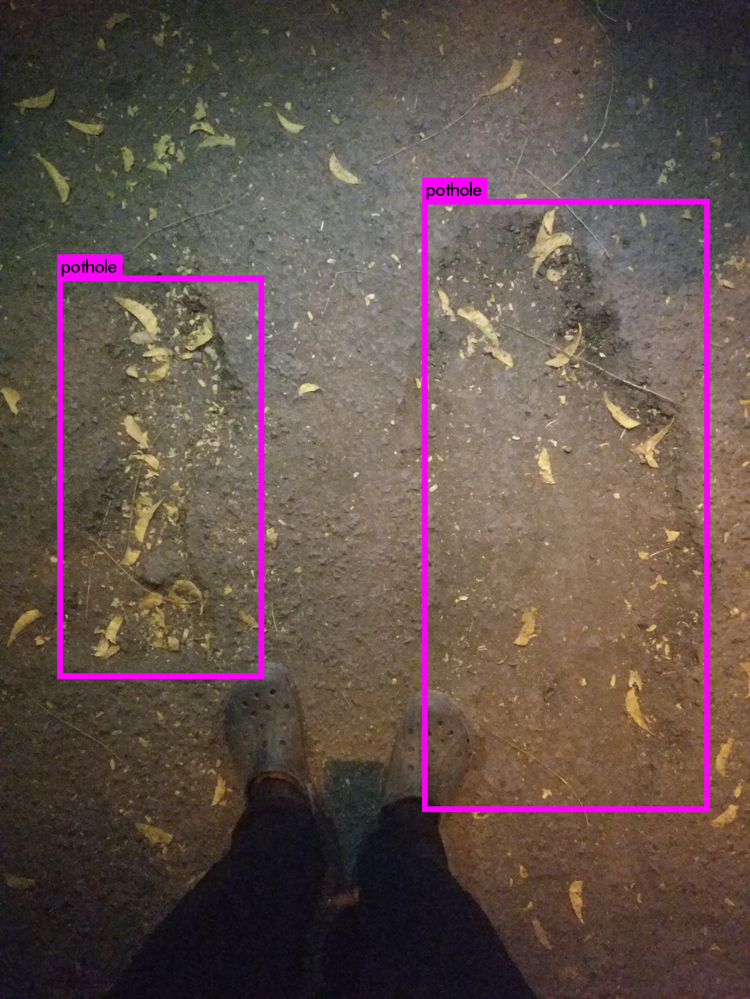

# deep-blue
<h2><b>This repository contains the python files created by us for our Pothole Detection App.</b></h2>

<h3>Aim of project:</h3>
<ul>
<li>Detect all potholes in a given image</li>
<li>Give the <b>Count</b></li>
<li><b>Area</b> of each pothole</li>
<li><b>Loaction</b></li>
<li><b>Depth</b></li>

The project use <b>YOLO object detection</b> from <b>AlexeyAB</b> github repo.

The python file help to process all files in a given location and use the YOLO dection on all the images in order to detect potholes.
<b>yolopython.py</b> gives the count of the potholes in each image and the lenght and breadth.
Next, we use another python file to process all the cropped images of each pothole and upload to our csv file.
<h4>Finally we use multiple linear regression to Predict the depth of each pothole.</h4>
</img>
